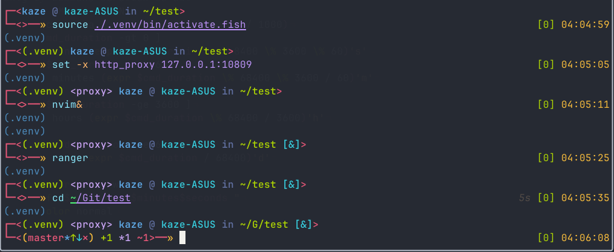

# Kish

Added some features based on [Zhishen Wen's simple fun theme](https://github.com/oh-my-fish/theme-zish) =)



## Installation
```sh
fisher install kaze-k/theme-kish
```

## Left prompt
Virtual environment, proxy, user, host, abbreviated path, jobs and git branch info

## Right prompt
Command duration, exit code and time

## Acknowledgments
Thanks to Zish theme's author

Enjoy!
