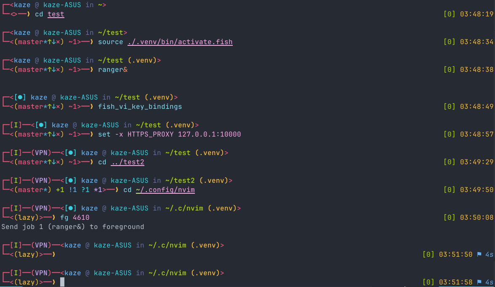

# Kish

Added some features based on [Zhishen Wen's simple fun theme](https://github.com/oh-my-fish/theme-zish) =)



## Installation
```sh
fisher install kaze-k/theme-kish
```

## Left prompt
vi mode, proxy, jobs, user, host, abbreviated path, Virtual environment and git branch info

## Right prompt
Exit code, time and command duration 

## Acknowledgments
Thanks to Zish theme's author

Enjoy!
